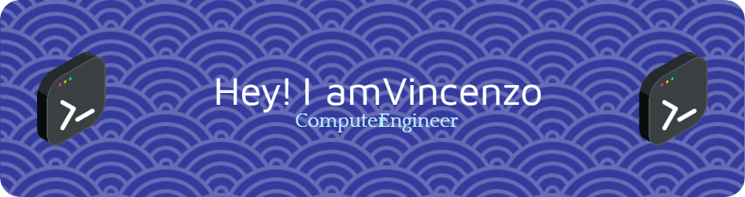

<h1 align="center">Hi 👋, I'm Vincenzo</h1>
<h3 align="center">Deep Learning enthusiast</h3>

---

  

<!--
  
-->

- 🔭 I’m currently working on **AI (ML/DL) projects.**

- 🌱 I’m currently learning **python for data analysis, frameworks for Big Data and PyTorch.**

- 📫 How to reach me **vincenzo.fraello@outlook.it**

- ⚡ Fun fact **Bazinga**

<h3 align="left">Connect with me:</h3>

---

<h3 align="left">Languages and Tools:</h3>

                           

&nbsp;

<!--
# Hi there 👋, my name is Vincenzo

# About me
As a Computer Engineering student at the University of Parma, I am particularly interested in deep learning, computer vision, and related topics.

- 🔭 I’m currently working on AI (ML/DL) projects. 
- 🌱 I’m currently learning python for data analysis, frameworks for Big Data and PyTorch. 
- 📚 Deep-Learning addicted.
- 📫 How to reach me: vincenzo.fraello@outlook.it.
- ⚡ Fun fact: Bazinga.

## 💻 Skills and Experiences:
- Python 
- JAVA 
- C
- C++
- Solidity
- REACT
- JS
- JQuery
- PHP
- HTML
- CSS
- Bootstrap

<i class="programming lang-ruby"></i>
<i class="programming lang-javascript"></i>
<i class="programming lang-cpp"></i>
<i class="programming lang-typescript"></i>
<i class="programming lang-python"></i>
<i class="programming lang-kotlyn"></i>

        

  

  
-->
